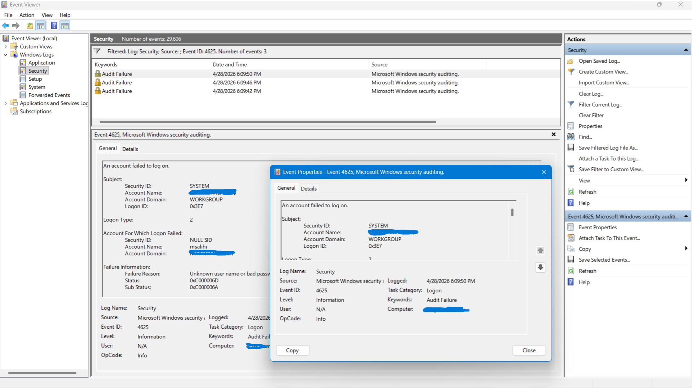

# Event ID 4625 – Failed Logon Attempt (Interactive Logon)

## Summary

Event ID **4625** indicates a **failed authentication attempt**.  
In this case, the failure occurred during an **interactive logon (Logon Type 2)**, meaning someone attempted to sign in locally at the machine and entered an incorrect password.  
This behaviour is expected when a user mistypes credentials or when an attacker attempts password guessing.

## Evidence (From System Logs)

### Subject (Process Requesting the Logon)
- **Security ID:** SYSTEM  
- **Account Name:** [MachineAccount]$  
- **Account Domain:** WORKGROUP  
- **Logon ID:** 0x3E7  

### Logon Type
- **Logon Type:** 2 (Interactive – local console logon)

### Account For Which Logon Failed
- **Security ID:** NULL SID  
- **Account Name:** msalihi  
- **Account Domain:** [MachineName]  

### Failure Information
- **Failure Reason:** Unknown user name or bad password  
- **Status:** 0xC000006D  
- **Sub Status:** 0xC000006A (Incorrect password)

### Process Information
- **Caller Process ID:** 0x85c  
- **Caller Process Name:** C:\Windows\System32\svchost.exe  

### Network Information
- **Workstation Name:** [MachineName]  
- **Source Network Address:** 127.0.0.1  
- **Source Port:** 0  

### Authentication Details
- **Logon Process:** User32  
- **Authentication Package:** Negotiate  
- **Key Length:** 0  

**

## Analysis

- The failed logon was **local**, not remote, as shown by:
  - **Logon Type 2** (interactive)
  - **Source Network Address: 127.0.0.1**
- The username **“msalihi”** attempted to authenticate but provided an incorrect password.
- The sub‑status **0xC000006A** confirms a **bad password**, not an unknown account.
- The process **svchost.exe** initiated the logon request, which is normal for Windows authentication handling.
- No indicators of lateral movement or remote brute‑force activity are present.

This event represents a **benign failed logon**, likely caused by a mistyped password.

## MITRE ATT&CK Context

Failed logons can be associated with:

- **Technique:** T1110 – Brute Force  
- **Tactic:** Credential Access  

Although this specific event is benign, repeated 4625 events may indicate password spraying or brute‑force attempts.

## Detection Logic (KQL Example)

```kusto
SecurityEvent
| where EventID == 4625
| project TimeGenerated, Account, FailureReason, LogonType, WorkstationName, Status, SubStatus

