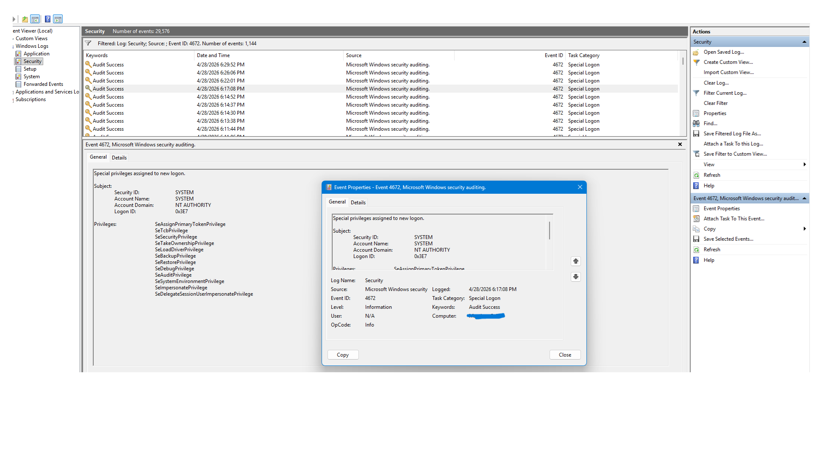

# Event ID 4672 – Special Privileges Assigned to New Logon

## Summary

Event ID **4672** is generated when an account logs on and receives **administrative or high‑privilege rights**.  
These privileges allow powerful system‑level actions such as debugging, loading drivers, taking ownership of files, and modifying security settings.

In this case, the privileges were assigned to the **SYSTEM** account, which is expected behaviour on a Windows machine.

## Evidence (From System Logs)

### Subject (Account Receiving Privileges)
- **Security ID:** SYSTEM  
- **Account Name:** SYSTEM  
- **Account Domain:** NT AUTHORITY  
- **Logon ID:** 0x3E7  

### Privileges Assigned
- SeAssignPrimaryTokenPrivilege  
- SeTcbPrivilege  
- SeSecurityPrivilege  
- SeTakeOwnershipPrivilege  
- SeLoadDriverPrivilege  
- SeBackupPrivilege  
- SeRestorePrivilege  
- SeDebugPrivilege  
- SeAuditPrivilege  
- SeSystemEnvironmentPrivilege  
- SeImpersonatePrivilege  
- SeDelegateSessionUserImpersonatePrivilege  

**


## Analysis

- The **SYSTEM** account is the highest‑privileged built‑in account in Windows.
- Logon ID **0x3E7** is the standard identifier for the local system logon session.
- The privileges listed are **normal** for SYSTEM and are required for core OS operations.
- No unusual user accounts or unexpected privilege assignments are present.
- No indicators of privilege escalation or malicious activity appear in this event.

This event represents **normal system behaviour**.

## MITRE ATT&CK Context

Privilege‑related events can be relevant to:

- **Technique:** T1548 – Abuse Elevation Control Mechanisms  
- **Technique:** T1543 – Create or Modify System Process  
- **Tactic:** Privilege Escalation  

Although this specific event is benign, attackers often attempt to obtain these privileges.

## Detection Logic (KQL Example)

```kusto
SecurityEvent
| where EventID == 4672
| project TimeGenerated, Account, Privileges, LogonID

