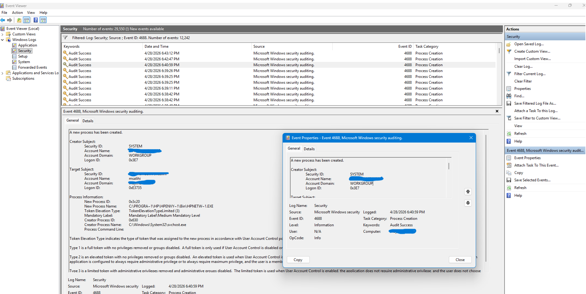

# Event ID 4688 – Process Creation Investigation

## Summary

Event ID **4688** is generated whenever a new process is created on a Windows system.  
This event is critical for detecting malware execution, LOLBins, privilege escalation, and suspicious command‑line activity.

In this case, a process belonging to HP printer software (`HPNETW~1.EXE`) was created by `svchost.exe`.  
The behaviour appears **benign** and consistent with normal vendor software activity.

## Evidence (From System Logs)

### Creator Subject (Process That Spawned the New Process)
- **Security ID:** SYSTEM  
- **Account Name:** [MachineAccount]$  
- **Account Domain:** WORKGROUP  
- **Logon ID:** 0x3E7  

### Target Subject (User Context of the New Process)
- **Security ID:** MaythamSalihi\msalihi  
- **Account Name:** msalihi  
- **Account Domain:** MaythamSalihi  
- **Logon ID:** 0xE3735  

### Process Information
- **New Process ID:** 0x3c20  
- **New Process Name:** C:\PROGRA~1\HP\HPENVY~1\Bin\HPNETW~1.EXE  
- **Creator Process ID:** 0x630  
- **Creator Process Name:** C:\Windows\System32\svchost.exe  
- **Token Elevation Type:** TokenElevationTypeLimited (3)  
- **Mandatory Label:** Medium Mandatory Level  
- **Process Command Line:** *(Not provided)*  

### Screenshot
```markdown
**

