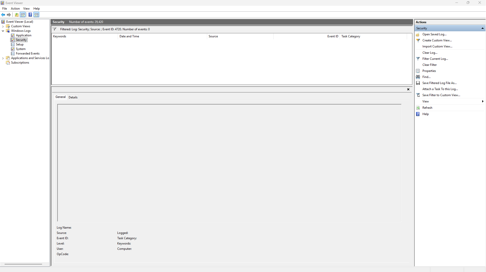

# Event ID 4720 – User Account Created (Attempted Investigation)

## Summary
Event ID **4720** is generated when a new **local user account** is created on a Windows system. This event is important for detecting unauthorized account creation, privilege escalation attempts, and persistence techniques used by attackers. During this investigation, I attempted to locate Event 4720 by filtering the Windows Security Log. The filter returned **no matching events**, which is expected if no local accounts have been created recently.

## Screenshot

## Interpretation of the Event
Event 4720 logs the creation of a new local user account. If no entries appear, it means:
- No new accounts were created by the user
- No system processes created accounts
- No administrative tools created accounts
- No malicious activity created unauthorized accounts

This is normal for a stable WORKGROUP system where user accounts are rarely modified.

## Why No Event Appears on This System
This machine is configured as a **WORKGROUP** device, not joined to a domain. Local account creation is uncommon unless:
- A new user is manually added
- A script or program creates an account
- A service installs with a dedicated user
- An attacker creates a persistence account

Since none of these actions occurred, Event 4720 does not appear.

## Investigation Steps Performed
1. Opened **Event Viewer**
2. Navigated to **Windows Logs → Security**
3. Applied filter for **Event ID: 4720**
4. Verified that **no events matched the filter**
5. Captured screenshot of the empty results
6. Documented findings and confirmed expected system behaviour

## SOC Analyst Interpretation
Event 4720 is critical for detecting:
- Unauthorized admin accounts
- Persistence mechanisms
- Suspicious account creation outside normal activity
- Accounts created by malware or scripts

In this case, the absence of Event 4720 indicates:
- No unauthorized accounts were created
- No suspicious activity related to account creation
- The system is behaving normally

## Conclusion
The investigation into Event ID 4720 was completed successfully. No user account creation events were found, which is expected for a WORKGROUP system with no recent account modifications. The empty result confirms that no unauthorized or unexpected accounts were created.

**Status:** Lab Completed – No Account Creation Events Present  
**Action Required:** None  
**Recommendation:** Continue monitoring for unexpected account creation activity.

