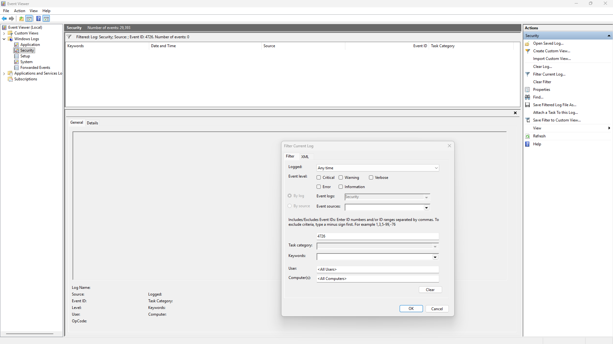

# Event ID 4726 – User Account Deleted (Attempted Investigation)

## Summary
Event ID **4726** is generated when a local user account is deleted on a Windows system. This event is important for detecting unauthorized account removal, privilege abuse, and attacker cleanup activity. During this investigation, I filtered the Windows Security Log for Event 4726. The filter returned **no matching events**, which is expected if no local accounts have been deleted recently.

## Screenshot

## Interpretation of the Event
Event 4726 logs the deletion of a local user account. If no entries appear, it means:
- No user accounts were removed by an administrator
- No system processes deleted accounts
- No malicious activity attempted to hide its presence by removing accounts

This is normal for a stable WORKGROUP system where user accounts are rarely modified.

## Why No Event Appears on This System
This machine is configured as a **WORKGROUP** device, not joined to a domain. Local account deletion is uncommon unless:
- A user is manually removed
- A script or tool deletes an account
- A service uninstalls and removes its associated user
- An attacker deletes accounts to cover tracks

Since none of these actions occurred, Event 4726 does not appear.

## Investigation Steps Performed
1. Opened **Event Viewer**
2. Navigated to **Windows Logs → Security**
3. Applied filter for **Event ID: 4726**
4. Verified that **no events matched the filter**
5. Captured screenshot of the empty results
6. Documented findings and confirmed expected system behaviour

## SOC Analyst Interpretation
Event 4726 is critical for detecting:
- Unauthorized account removal
- Privilege abuse by insiders
- Attacker cleanup activity
- Attempts to remove evidence of persistence

In this case, the absence of Event 4726 indicates:
- No accounts were deleted
- No suspicious account‑related activity occurred
- The system is behaving normally

## Conclusion
The investigation into Event ID 4726 was completed successfully. No user account deletion events were found, which is expected for a WORKGROUP system with no recent account modifications. The empty result confirms that no unauthorized or unexpected account deletions occurred.

**Status:** Lab Completed – No Account Deletion Events Present  
**Action Required:** None  
**Recommendation:** Continue monitoring for unexpected account deletion activity.
