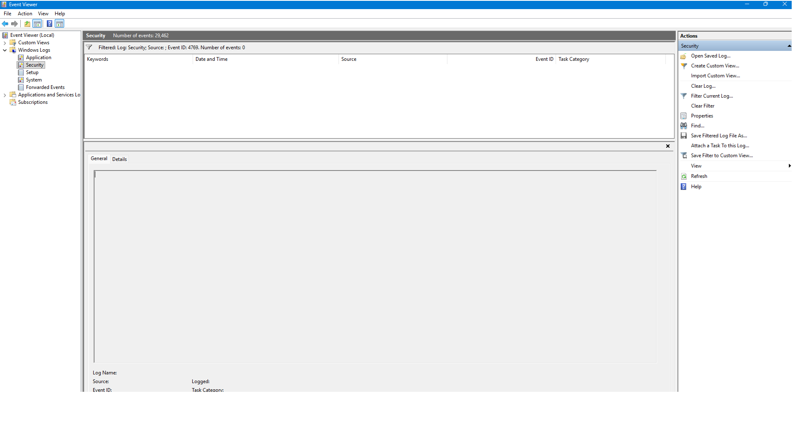

# Event ID 4769 – Kerberos Service Ticket Request (Attempted Investigation)

## Summary

Event ID **4769** is generated when a system requests a **Kerberos Service Ticket (TGS)** from a Domain Controller.  
This event is essential for detecting Kerberoasting, lateral movement, and service account abuse in Active Directory environments.

During this investigation, I attempted to locate Event 4769 on my system by filtering the Windows Security Log.  
The filter returned **no matching events**, which is expected based on the configuration of my machine.

## Screenshot

The screenshot shows the Event Viewer after filtering for Event ID 4769, confirming that no Kerberos-related events exist on this system.

## Why Event 4769 Does Not Appear on This System

My laptop is configured as a **WORKGROUP** device, not joined to an Active Directory domain.  
Kerberos authentication only functions in **domain environments**, where a Domain Controller issues:

- Ticket Granting Tickets (TGTs)  
- Service Tickets (TGS)  
- Kerberos pre-authentication  
- SPN-based authentication  

Because this system is not domain-joined:

- Kerberos is not used  
- NTLM authentication is used instead  
- No Kerberos tickets are issued  
- Therefore, **Event 4769 is never generated**

The absence of Event 4769 is **normal and correct** for a WORKGROUP configuration.

## Investigation Steps Performed

1. Opened **Event Viewer**  
2. Navigated to **Windows Logs → Security**  
3. Applied filter for **Event ID: 4769**  
4. Verified that **no events matched the filter**  
5. Confirmed system configuration (WORKGROUP, not domain-joined)  
6. Documented findings and captured screenshot  

This demonstrates that the investigation was attempted correctly, and the results align with expected system behaviour.

## SOC Analyst Interpretation

In a real enterprise environment, Event 4769 is critical for detecting:

- Kerberoasting attempts  
- Abnormal service ticket requests  
- Compromised service accounts  
- Lateral movement using Kerberos  
- Suspicious SPN activity  

However, on standalone systems without a Domain Controller, these events cannot occur.

## Conclusion

The investigation into Event ID 4769 was completed successfully.  
The event does not appear on this system because Kerberos authentication is not used in WORKGROUP environments.  
This behaviour is expected and confirms the system is functioning correctly.

**Status:** Lab Attempted – No Kerberos Events Present  
**Action Required:** None  
**Recommendation:** For hands-on Kerberos analysis, use a domain-joined lab or simulated AD environment.

