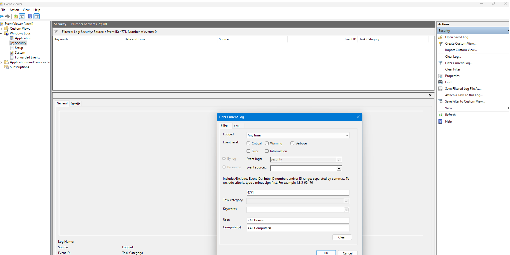

# Event ID 4771 – Kerberos Pre‑Authentication Failure (Attempted Investigation)

## Summary

Event ID **4771** is generated when a Kerberos pre‑authentication attempt fails.  
This event is commonly used to detect password‑guessing attacks, account misuse, and suspicious authentication behaviour in Active Directory environments.

During this investigation, I attempted to locate Event 4771 by filtering the Windows Security Log.  
The filter returned **no matching events**, which is expected based on the configuration of my system.

##Screenshot

The screenshot shows the Event Viewer after filtering for Event ID 4771, confirming that no Kerberos-related events exist on this system.

## Why Event 4771 Does Not Appear on This System

My laptop is configured as a **WORKGROUP** device, not joined to an Active Directory domain.  
Kerberos authentication only functions in **domain environments**, where a Domain Controller handles:

- Pre‑authentication  
- Ticket Granting Tickets (TGTs)  
- Service Tickets (TGS)  
- SPN-based authentication  
- Kerberos encryption and validation  

Because this system is not domain‑joined:

- Kerberos is not used  
- NTLM authentication is used instead  
- No Kerberos pre‑authentication occurs  
- Therefore, **Event 4771 is never generated**

The absence of Event 4771 is **normal and correct** for a WORKGROUP configuration.

## Investigation Steps Performed

1. Opened **Event Viewer**  
2. Navigated to **Windows Logs → Security**  
3. Applied filter for **Event ID: 4771**  
4. Verified that **no events matched the filter**  
5. Confirmed system configuration (WORKGROUP, not domain-joined)  
6. Documented findings and captured screenshot  

This demonstrates that the investigation was attempted correctly and that the results align with expected system behaviour.

## SOC Analyst Interpretation

In an enterprise environment, Event 4771 is critical for detecting:

- Password spraying  
- Brute‑force attacks  
- Misconfigured service accounts  
- Time skew issues  
- Suspicious authentication failures  
- Attempts to crack Kerberos pre‑authentication  

However, on standalone systems without a Domain Controller, these events cannot occur.

## Conclusion

The investigation into Event ID 4771 was completed successfully.  
The event does not appear on this system because Kerberos authentication is not used in WORKGROUP environments.  
This behaviour is expected and confirms the system is functioning correctly.

**Status:** Lab Attempted – No Kerberos Events Present  
**Action Required:** None  
**Recommendation:** For hands‑on Kerberos failure analysis, use a domain‑joined lab or simulated AD environment.

