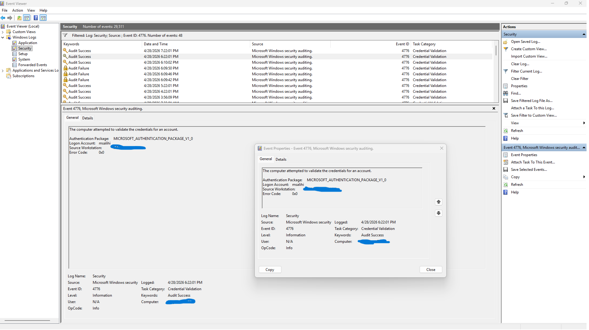

# Event ID 4776 – NTLM Authentication (Successful Credential Validation)

## Summary
Event ID **4776** is generated when a computer attempts to validate a user’s credentials using the **NTLM authentication protocol**. Because this system is configured as a **WORKGROUP** device (not domain‑joined), NTLM is the default authentication method. Therefore, Event 4776 is expected to appear regularly in the Security Log. This event confirms that the system successfully validated the credentials for the specified account.

## Screenshot

## Raw Event Data (Provided)
The computer attempted to validate the credentials for an account.

Authentication Package:  MICROSOFT_AUTHENTICATION_PACKAGE_V1_0  
Logon Account:           msalihi  
Source Workstation:      MAYTHAMSALIHI  
Error Code:              0x0  

## Interpretation of the Event
This Event 4776 entry indicates:
- **Authentication Package:** NTLM (`MICROSOFT_AUTHENTICATION_PACKAGE_V1_0`)
- **Logon Account:** The username being validated (`msalihi`)
- **Source Workstation:** The machine performing the authentication (`MAYTHAMSALIHI`)
- **Error Code 0x0:** Authentication **succeeded**

This means the credentials provided for the account were correct, and NTLM successfully validated the login attempt.

## Why This Event Appears on This System
Since the machine is part of a **WORKGROUP**, not an Active Directory domain:
- Kerberos is **not used**
- NTLM becomes the default authentication protocol
- Local logons and system processes frequently trigger Event 4776

This makes Event 4776 one of the most common authentication events on standalone Windows systems.

## Investigation Steps Performed
1. Opened **Event Viewer**
2. Navigated to **Windows Logs → Security**
3. Applied filter for **Event ID: 4776**
4. Identified NTLM authentication events
5. Captured raw event data and screenshot
6. Analyzed authentication details and error code

## SOC Analyst Interpretation
Event 4776 is important for detecting:
- Password spraying (multiple failures)
- Brute‑force attempts
- Unauthorized access attempts
- Malware or scripts attempting authentication
- Lateral movement attempts using NTLM

In this case, the event shows a **successful** NTLM authentication with no signs of malicious activity.

## Conclusion
The investigation into Event ID 4776 confirms that NTLM authentication is functioning normally on this WORKGROUP system. The event shows a successful credential validation for the account `msalihi`, with no errors or suspicious indicators.

**Status:** Lab Completed – NTLM Authentication Event Captured  
**Action Required:** None  
**Recommendation:** Continue monitoring for repeated failures or unusual authentication patterns.
