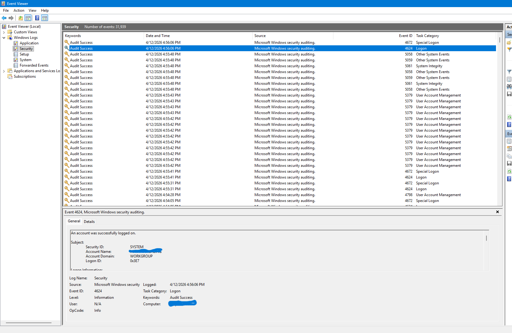

## Event ID 4624 — Successful Logon

### Summary
A Windows Security Event ID **4624** indicates a **successful logon** to the system. This event is generated whenever a user, service, or computer account successfully authenticates. In this case, the logon was performed by the **SYSTEM** account using **Logon Type 5**, which represents a **service logon**. This is normal behaviour for internal Windows operations.

---

### Evidence
**Security ID:** SYSTEM  
**Account Name:** (insert account name)  
**Account Domain:** WORKGROUP  
**Logon ID:** 0x3E7  
**Logon Type:** 5 (Service Logon)  
**Logon Process:** Advapi  
**Authentication Package:** Negotiate  
**Workstation Name:** (insert workstation name)  
**Source Network Address:** (blank)  
**Source Port:** (blank)

---

### Analysis
- **Logon Type 5** indicates a **service** started on the system.  
- The **SYSTEM** account is used by Windows to run internal processes.  
- The Logon ID **0x3E7** is a well‑known identifier for the **Local System** logon session.  
- No remote IP address or port is present, confirming this was **not** a network logon.  
- This type of event is commonly generated when:
  - Windows services start  
  - Scheduled tasks run  
  - System components authenticate internally  

There are **no indicators of compromise** in this event.

---

### Conclusion
This Event ID 4624 entry represents **normal system activity**.  
A Windows service successfully authenticated using the SYSTEM account.  
No suspicious behaviour detected.

---

### Files Included
- event4624.png
