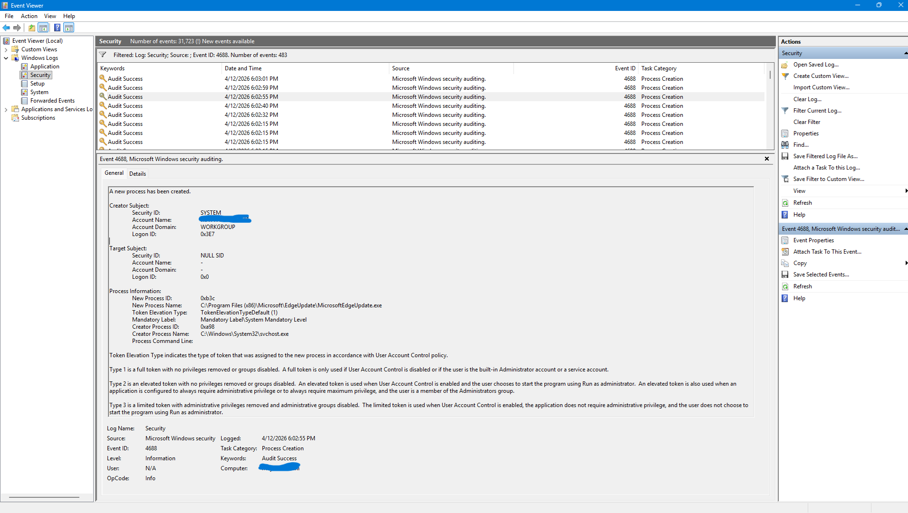

## Event ID 4688 — Process Creation Investigation

### Summary
A Windows Security Event ID 4688 was recorded, indicating that a new process was created on the system. In this case, the process **"MicrosoftEdgeUpdate.exe"** was launched by **"svchost.exe"** under the **SYSTEM** user. This behaviour is consistent with normal Windows update operations and does not indicate malicious activity.

---

### Evidence
**User Name:** SYSTEM  
**Process Name:** svchost.exe  
**Parent Process Name:** svchost.exe  
**New Process Name:** C:\Program Files (x86)\Microsoft\EdgeUpdate\MicrosoftEdgeUpdate.exe  
**Process Command Line:** C:\Program Files (x86)\Microsoft\EdgeUpdate\MicrosoftEdgeUpdate.exe  
**Process Identifier (PID):** (insert PID)  
**Parent Process Identifier:** (insert parent PID)  
**Creator Subject:** System (Primary SID)  
**Command Line:** (blank)

---

### Analysis
- This is a **legitimate system‑initiated process creation**.  
- **svchost.exe** is a trusted Windows service host responsible for running system services.  
- **MicrosoftEdgeUpdate.exe** is a valid Microsoft updater binary located in the correct installation directory.  
- No suspicious command‑line arguments were present.  
- No abnormal parent‑child relationship was observed.  
- No indicators of compromise were identified.

---

### Conclusion
**Normal system activity. No action required.**

---

### Files Included
- `screenshots/Event ID 4688 — Process Creation Investigation.png`  
- `report.md`
